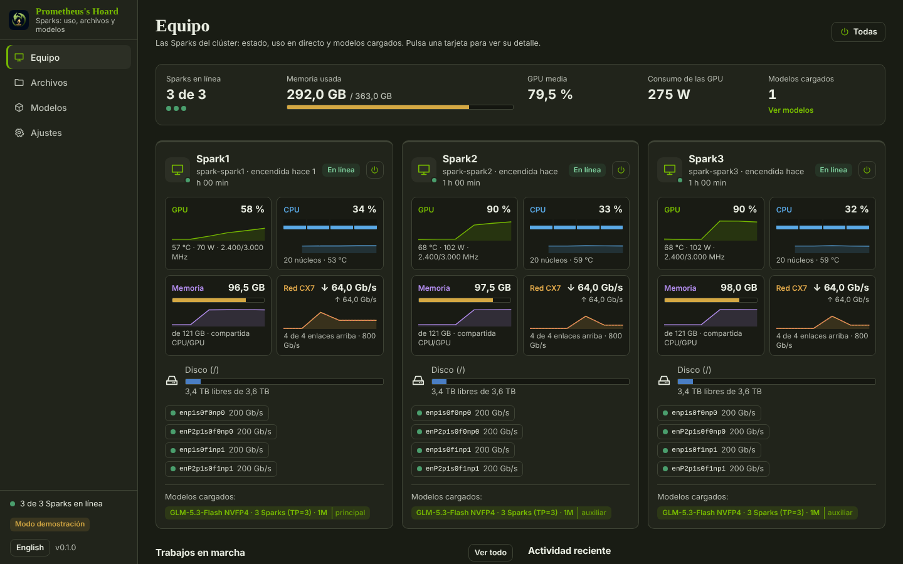
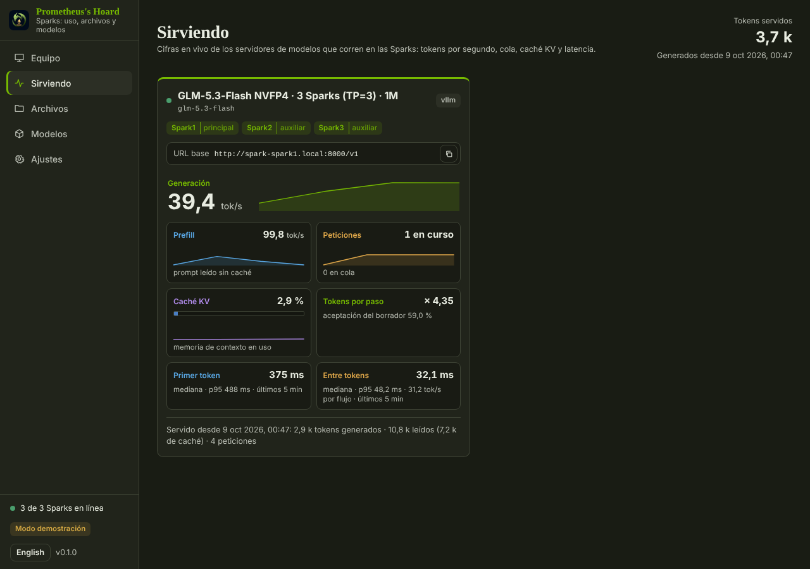
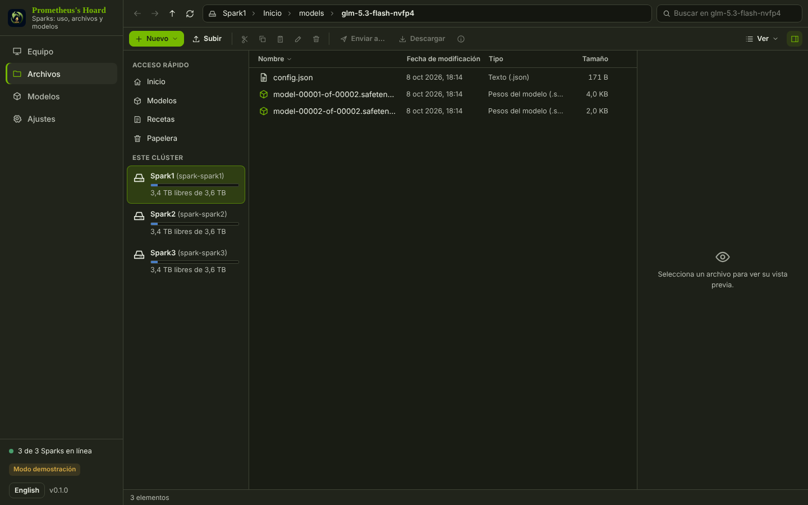
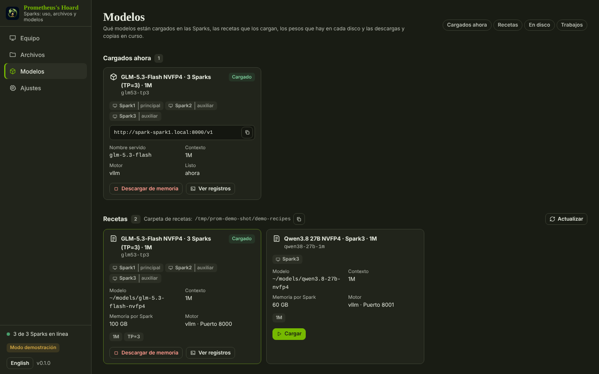

# Prometheus's Hoard

Maneja desde el PC con Windows un clúster pequeño de NVIDIA DGX Spark. Cada Spark es una unidad en un explorador de archivos; su GPU, CPU, memoria unificada, consumo, discos y red se ven en directo; los modelos de sus discos se listan y se descargan; los modelos se cargan y se descargan de memoria con recetas; y cada Spark se puede bloquear, suspender, apagar, reiniciar o encender desde la misma ventana. Es de la familia Hoard: funciona sola, desde Hoard Hub, desde Faustus y desde cualquier cliente MCP.



## Qué hace

- **Equipo**: una tarjeta por Spark con estado, tiempo encendida, uso de GPU, temperatura, consumo y reloj, uso de CPU por núcleo, memoria unificada, disco, enlaces CX7 y los modelos que sirve (cabeza o trabajador). Vista tipo Administrador de tareas por Spark con gráficas grandes, procesos, contenedores, servidores de inferencia detectados e interfaces de red.
- **Sirviendo**: cifras en vivo de cada servidor de inferencia en marcha (de receta o arrancado a mano), leídas de la página de Prometheus que publica vLLM en `/metrics`: tokens por segundo de generación y de lectura del prompt con una gráfica de diez minutos, peticiones en curso y en cola, uso de la caché KV, tokens por paso y aceptación de la decodificación especulativa si el servidor tiene borrador, mediana y percentil 95 del tiempo hasta el primer token y del tiempo entre tokens (también como tokens por segundo por flujo), un aviso si hubo peticiones expulsadas y los tokens servidos hasta ahora, con la URL base lista para copiar. La página se actualiza cada 2 s mientras está abierta. Cada tarjeta termina con **Clientes**: quién usa ese servidor, leído del registro de accesos HTTP de su contenedor (vLLM no apunta quién pregunta, pero su servidor web registra cada petición): por dirección de cliente, las peticiones por API (OpenAI chat, completions, Responses, Anthropic Messages, embeddings, otras), peticiones por hora, errores (que no sean 2xx), cuándo se vio por última vez y una etiqueta si solo sondea `/health`, `/v1/models` o `/metrics`. Los nombres se editan ahí mismo (ajuste `client_names`, herramienta `client_name_set`); este PC se nombra solo, las Sparks por sus propias direcciones, y al desplegar **Este PC** salen los programas de aquí que tienen conexiones abiertas con el servidor ahora mismo (las apps Hoard por su módulo, Faustus, asistentes y, si no, el ejecutable). Las sondas del propio servidor desde 127.0.0.1 solo se cuentan.
- **Tarjetas de velocidad y de capacidad** (en cada servidor de Sirviendo, separadas a propósito): **Velocidad** es una medición que se lanza con **Medir** (pide confirmación: manda cientos de peticiones de chat en streaming al servidor compartido durante varios minutos). Corre como trabajo con 1, 8, 16 y 64 flujos a la vez, un prompt único por petición (un nonce aleatorio al principio, así la caché de prefijos nunca responde), una ronda de calentamiento descartada y la mediana de tres rondas, y da por nivel los tokens por segundo agregados, los tokens por segundo de decodificación de un flujo (mediana), el tiempo hasta el primer token (p50 y p95) y las peticiones fallidas. Cuenta todos los tokens generados, razonamiento incluido (el `usage` del servidor si lo envía y, si no, los fragmentos del stream). Los resultados se guardan en `data/speedcards.json` (los últimos 20 por servidor). **Capacidad** se lee en vivo y cuesta dos peticiones pequeñas: el contexto que acepta el servidor (`/v1/models`), el pool KV en tokens (`vllm:cache_config_info`: bloques × tamaño de bloque, con cuántas peticiones de contexto completo caben) y lo que la receta registró como verificado. Herramientas: `speed_card` (lectura) y `speed_card_run` (lanza el trabajo; exige `confirm=true`; quien llama debe tener el bloqueo del modelo principal; una medición a la vez por servidor; se cancela con `job_cancel`).
- **Errores de GPU**: cada 60 s (`xid_interval_s`; `xid_watch` lo apaga en Ajustes) lee los mensajes nuevos del kernel de cada Spark (`journalctl -k --since ... -o short-iso` por SSH) y guarda las líneas que informan de un `Xid` de NVIDIA (con su código), un reinicio completo del chip (`NV_ERR_GPU_IN_FULLCHIP_RESET`) o un error, tiempo de espera o fallo de GSP, en `data/xid_events.json` (las últimas 500). Salen arriba en Sirviendo, marcadas en la tarjeta de la Spark y en la herramienta `xid_events`, y cada una nueva se avisa por el canal de notificaciones del hub de la familia (`xid_notify`; el hub decide cómo). Solo avisa: nunca reinicia ni resetea nada.
- **Archivos**: explorador con cada Spark como unidad. Barra de direcciones, atrás/adelante/arriba, búsqueda, vista de detalles e iconos, ocultos, vista previa (texto con números de línea, JSON, imágenes, vídeo, audio) y edición de texto, subir arrastrando, descargar, nueva carpeta y archivo, renombrar (F2), cortar/copiar/pegar (Ctrl+X/C/V), enviar a otras Sparks por los cables CX7, propiedades con el tamaño de la carpeta y papelera por Spark con restaurar. Solo escribe dentro de la carpeta personal del usuario de la Spark; el resto del disco se puede mostrar en solo lectura.
- **Modelos**: lo que está cargado con su URL compatible con OpenAI; recetas con botón Cargar (si otra receta usa esas Sparks lo dice y ofrece descargarla antes); modelos en cada disco con tamaño, arquitectura, cuantización y contexto; descargas de Hugging Face; copias entre Sparks por CX7 (rsync, reanudables); trabajos con progreso y registros.
- **Encendido**: bloquear, suspender, apagar y reiniciar una Spark o todas; encender usa wake-on-LAN con la MAC del cable que aprendió mientras estaba encendida. Antes de apagar descarga los modelos de esa Spark.
- **Endpoints para otros programas**: `GET /api/endpoints` da los servidores de inferencia en marcha (primero la receta por defecto). Faustus lo lee para usar las Sparks como backend por defecto. `GET /api/serving` devuelve las cifras en vivo de esos servidores (`{endpoints, totals, poll_s, now}`; `?recipe=` filtra, `?series=false` quita los puntos de las gráficas) y la herramienta `serving_stats` da lo mismo a un asistente (cada endpoint lleva `clients`, salvo con `?clients=false` / `clients: false`). `sparks_overview` lleva un resumen corto `serving` por endpoint.







## Recetas

Las recetas medidas muestran los tokens de entrada, la velocidad de generación estimada, el tiempo hasta el primer token y el resultado de recuperación. «Ver todas las mediciones» despliega todos los valores registrados, incluidas las pruebas de referencia anidadas, las posiciones de recuperación y la memoria de caché. Los datos proceden de `measured` en la receta; el panel no ejecuta pruebas ni certifica sus resultados.

Una receta es una carpeta con `recipe.json` y los scripts que arrancan y paran un servidor (`start.sh`, `stop.sh`, y si quiere `health.sh` y `logs.sh`). La carpeta de recetas es un ajuste (por defecto `Sparks cluster/recipes`, junto a este repositorio). Cargar copia la carpeta a cada Spark que usa, ejecuta `start.sh` en cada una (primero la cabeza salvo que `start_order` diga otra cosa) como trabajo en segundo plano y espera a que la cabeza responda en su puerto.

## Arrancar

```
python -m venv venv
venv\Scripts\pip install -r requirements.txt
venv\Scripts\python -m prometheus_hoard        # http://127.0.0.1:5205
```

Las Sparks se alcanzan con la configuración SSH del PC (`~/.ssh/config` y sus `Include`; NVIDIA Sync escribe ahí los alias `Spark1`..`Spark3`). En Ajustes cada Spark puede tener otra dirección o un salto intermedio. `PROMETHEUS_FAKE=1` arranca un clúster inventado de tres Sparks para probar la interfaz sin hardware.

El puente MCP es `python mcp_server.py` (42 herramientas). Las destructivas (borrado permanente, vaciar la papelera, borrar un modelo, encendido, comandos) piden `confirm=true`.

## Qué no hace

- Las cifras de Sirviendo salen solo del `/metrics` de vLLM: un servidor de otro motor aparece en la lista con el motivo por el que no tiene cifras. Se muestrea cada 2 s mientras la página o un asistente miran y cada 10 s en el resto del tiempo; se guardan unos 15 minutos de muestras en memoria, así que las gráficas empiezan vacías tras reiniciar la app.
- Los clientes salen del registro de accesos del contenedor, leído en la Spark principal con `docker logs --since` (`sudo -n docker` si el usuario no está en el grupo docker; si no va ninguno, la tarjeta lo dice) cada ~20 s mientras la página o un asistente miran y cada 2 min en el resto; un resumen de 24 h queda en `data/clients.json`. Una dirección es un equipo: los programas de otros ordenadores no se distinguen, un cliente tras un proxy sale como el proxy y el registro solo guarda lo que el contenedor ha escrito desde que arrancó. Solo en este PC se distinguen programas, con la tabla de conexiones del sistema operativo (`psutil`): un programa de otro usuario puede salir sin nombre, y la lista es una foto de lo conectado ahora, no un historial.
- Los totales de tokens servidos (`data/serving.json`, se guarda cada 30 s y al salir) solo cuentan lo que la app vio mientras estaba en marcha. Los contadores de los servidores se reinician con su contenedor; la app detecta la bajada y suma el valor anterior como desplazamiento, pero lo servido con la app cerrada (y un servidor que se reinició en ese hueco) se pierde.
- La tarjeta de velocidad mide el servidor tal como está cuando se pide: compite con lo demás que use el modelo, un servidor que rechace `ignore_eos` puede cortar algún flujo antes, y solo vale para servidores que hablen el chat en streaming de OpenAI. El pool KV es el que vLLM informa por worker; no promete que una petición de esa longitud se sirva. De una medición cancelada no se guarda nada.
- El vigilante de errores de GPU solo ve lo que el usuario de la Spark puede leer del journal del kernel (`journalctl -k` sin sudo), consulta cada cierto tiempo en vez de seguir el registro y solo avisa si el Hoard Hub responde; sin hub el evento se guarda y se muestra igualmente. El cursor de cada lectura sigue el reloj de la Spark.
- No instala drivers, no cambia la red de las Sparks ni compila motores de inferencia: eso lo hacen las recetas.
- Apagar, reiniciar y suspender necesitan `sudo` sin contraseña (o una regla de polkit) en las Sparks; si no, lo rechaza y dice la línea que hay que añadir.
- El wake-on-LAN solo funciona si el firmware de la Spark lo tiene activado.
- No descarga carpetas enteras al PC de una vez (se envían a otra Spark o se comprimen antes).

Licencia MIT.
